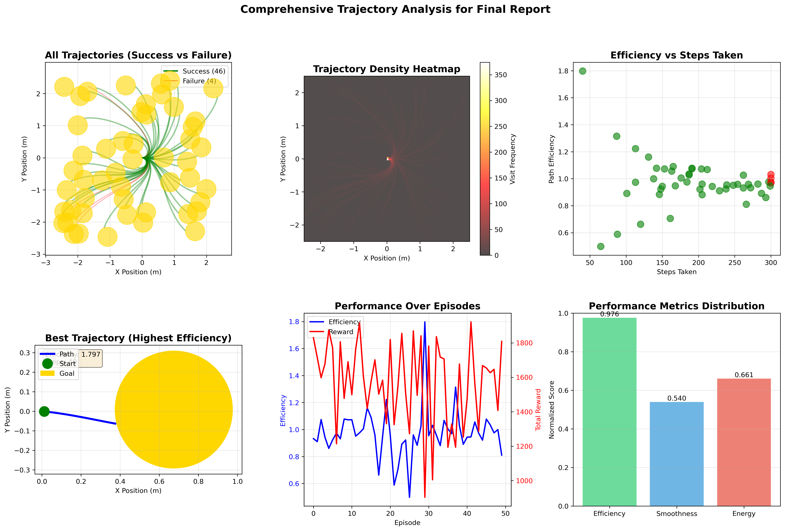
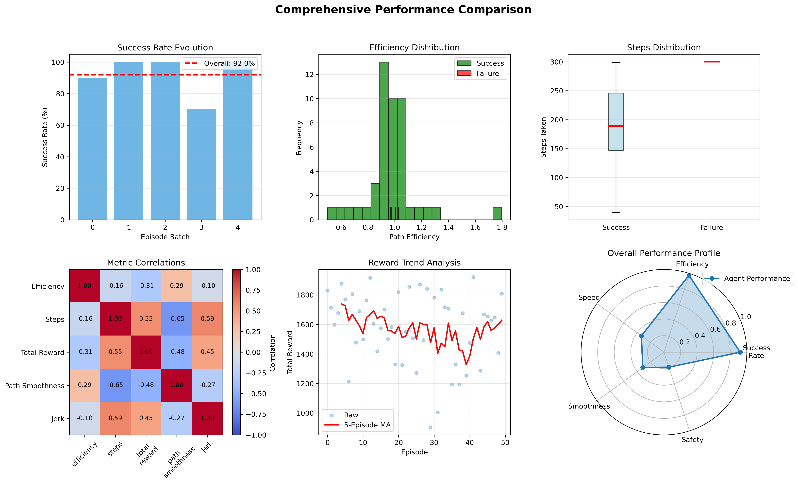
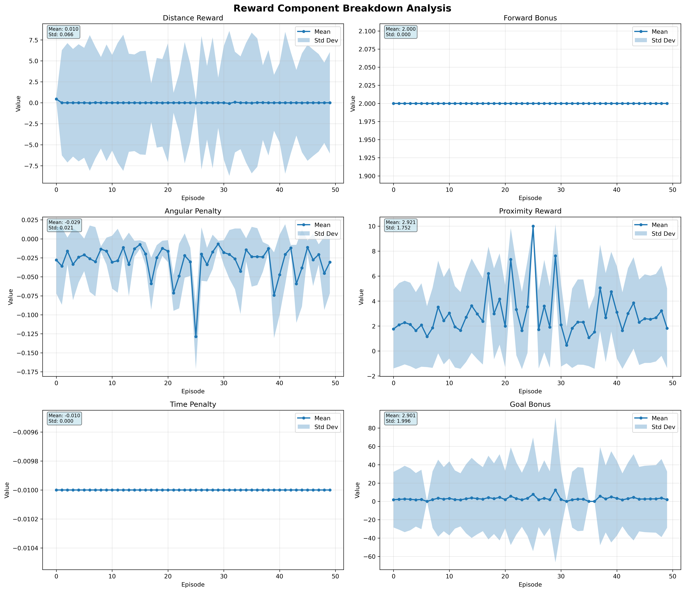
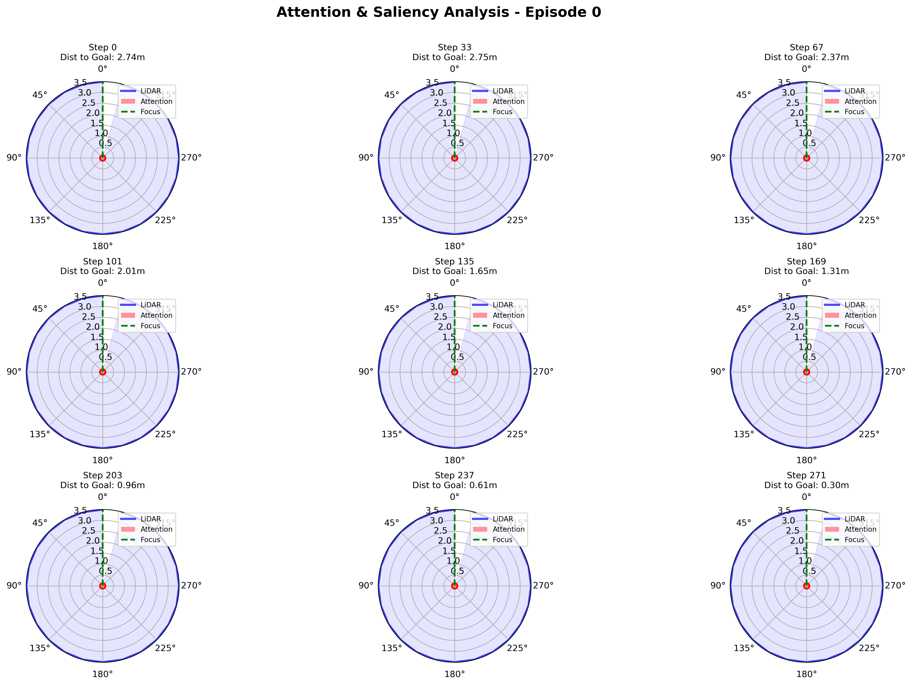

# Reinforcement Learning-Based Goal Navigation for TurtleBot3

This is a simple reinforcement learning–based navigation project for TurtleBot3.
The agent is trained(TurtleBot3) in an empty  world in gazebo where random goal positions are generated, and the robot learns to navigate autonomously to the goal.

The focus of this project is goal-directed navigation using reinforcement learning, without obstacles, to establish a strong baseline policy. This project achieves **92% success rate** with efficient, smooth trajectories using only LIDAR-based perception and goal-relative state representation.


## Table of Contents

- [Overview](#overview)
- [Key Results](#key-results)
- [Mathematical Framework](#mathematical-framework)
- [System Architecture](#system-architecture)
- [Installation](#installation)
- [Usage](#usage)
- [Performance Analysis](#performance-analysis)
- [Project Structure](#project-structure)
- [Citation](#citation)

---


## Overview

This project implements reinforcement for goal-directed navigation in obstacle-free environments. The system uses Proximal Policy Optimization (PPO) to learn control policies that map LIDAR observations and goal information directly to velocity commands, achieving near-optimal path efficiency while maintaining smooth, energy-efficient trajectories.


### Key Highlights

- **Success Rate**: 92% (46/50 test episodes)
- **Average Path Efficiency**: 0.976 (97.6% optimal)
- **Average Steps to Goal**: 199.04 ± 70.41
- **Average Time to Goal**: 9.95 ± 3.52 seconds
- **Training Timesteps**: 300,000 (stable performance)

### Demo GIF


*Trained agent successfully navigating to goal positions in real-time*


---

## Key Results

### Performance Metrics Summary

| Metric | Value | Description |
|--------|-------|-------------|
| **Success Rate** | **92.0%** | Reached goal within 0.3m threshold |
| **Path Efficiency** | **0.976 ± 0.182** | Ratio of optimal to actual path length |
| **Average Steps** | **199.04 ± 70.41** | Steps per successful episode |
| **Average Reward** | **1574.62 ± 241.85** | Cumulative episode reward |
| **Path Smoothness** | **0.460 ± 0.056** | Angular variation metric |
| **Jerk (Motion Quality)** | **0.0117 ± 0.0008** | Rate of acceleration change |
| **Energy Consumption** | **0.0273 ± 0.0123** | Normalized energy usage |


### Visualizations



*Comprehensive trajectory analysis showing: (a) All trajectories color-coded by success/failure, (b) Spatial density heatmap, (c) Efficiency vs steps correlation, (d) Best trajectory example, (e) Performance evolution over episodes, (f) Normalized performance metrics*



*Detailed performance metrics: Success rate evolution across episode batches, efficiency distribution, steps distribution comparison, metric correlations, reward trend analysis with moving average, and overall performance radar chart*

---


##  Mathematical Framework

## Symbol Guide & Notation Reference

### Core Mathematical Symbols
- **∈** : "belongs to" or "is an element of"
- **⊆** : "is a subset of"
- **→** : "maps to" or "goes to"
- **∀** : "for all"
- **∑** : summation (sum of terms)
- **∏** : product (multiplication of terms)
- **≈** : "approximately equal to"
- **≥, ≤** : greater/less than or equal to
- **|x|** : absolute value of x
- **||x||₂** : Euclidean norm (distance)

### Reinforcement Learning Symbols
- **S** : State space (all possible states)
- **A** : Action space (all possible actions)
- **P** : Transition probability function
- **R** : Reward function
- **γ** (gamma) : Discount factor (how much we value future rewards)
- **π** (pi) : Policy (strategy for choosing actions)
- **θ** (theta) : Policy network parameters
- **ϕ** (phi) : Value network parameters
- **ε** (epsilon) : Small threshold or clip range

### Navigation-Specific Symbols
- **v** : Linear velocity (forward/backward speed)
- **ω** (omega) : Angular velocity (rotation speed)
- **s_t** : State at time t
- **a_t** : Action at time t
- **r_t** : Reward at time t
- **d_t** : Distance to goal at time t

---

## 1. Markov Decision Process Formulation

The navigation problem is formulated as a continuous MDP:

```math
M = (S, A, P, R, γ)
```

where:

- **S ⊆ ℝ²⁷** : Continuous state space (27-dimensional real numbers)
- **A ⊆ ℝ²** : Continuous action space (2-dimensional: linear & angular velocity)
- **P : S × A × S → [0,1]** : Transition probability (likelihood of moving from one state to another)
- **R : S × A → ℝ** : Reward function (feedback for taking action in a state)
- **γ = 0.99** : Discount factor (weights immediate vs future rewards)

---

## 2. State Representation

The state vector at time *t* combines sensor data with goal-relative information:

```math
s_t = [l_t; \Delta x_g; \Delta y_g; \theta_r] \in \mathbb{R}^{27}
```

### Components:

### **LIDAR Scan Data** ($l_t \in \mathbb{R}^{24}$):

- 360° scan divided into 24 sectors (15° each)
- Each sector: $l_t^i = \min_{j \in \text{sector}_i} \text{range}_j$
- Range: $l_t^i \in [0, 3.5]$ meters
- Invalid readings (inf/NaN) clamped to 3.5m

**What this means:** The robot has a LIDAR sensor that scans all around it. We divide the 360° circle into 24 slices, and for each slice, we record the distance to the nearest obstacle. If there's no obstacle detected, we just say it's 3.5 meters away.

### **Goal-Relative Position** ($\Delta x_g, \Delta y_g \in \mathbb{R}$):

```math
\Delta x_g = (x_g - x_r) \times 0.2
```

```math
\Delta y_g = (y_g - y_r) \times 0.2
```

where:
- $(x_r, y_r)$ : robot position
- $(x_g, y_g)$ : goal position
- 0.2 : scaling factor to balance perception and navigation signals

**What this means:** We calculate how far the goal is from the robot in x and y directions, then multiply by 0.2 to keep the numbers in a reasonable range for the neural network.

### **Relative Heading** ($\theta_r \in [-\pi, \pi]$):

```math
\theta_r = \text{atan2}(\sin(\theta_g - \theta_o), \cos(\theta_g - \theta_o))
```

where:
- $\theta_o$ : Current robot orientation (from odometry)
- $\theta_g = \text{atan2}(\Delta y, \Delta x)$ : Angle to goal
- Normalized to $[-\pi, \pi]$ for continuity

**What this means:** This tells the robot which direction it needs to turn to face the goal. The value ranges from -π to π radians (-180° to 180°).

---

## 3. Action Space

The agent outputs continuous velocity commands:

```math
A = \{(v, \omega) \mid v \in [0, v_{\max}], \omega \in [-\omega_{\max}, \omega_{\max}]\}
```

with:
- **v** : Linear velocity, $v_{\max} = 0.22$ m/s
- **ω** : Angular velocity, $\omega_{\max} = 2.0$ rad/s

These are directly published as ROS Twist messages:
```python
cmd.linear.x = v
cmd.angular.z = ω
```

**What this means:** The robot can move forward at speeds from 0 to 0.22 m/s, and rotate at speeds from -2.0 to 2.0 rad/s (negative = left, positive = right).

---

## 4. Reward Function Design

The reward function balances multiple objectives:

```math
R(s_t, a_t, s_{t+1}) = R_d + R_g + R_c + R_f + R_a + R_p + R_t
```

### 4.1 Distance Reward (Progress Incentive)

Rewards reduction in distance to goal:

```math
R_d = k_d \cdot (d_t - d_{t+1})
```

where:
- $d_t = ||p_g - p_t||_2$ : Euclidean distance to goal at time *t*
- $k_d = 50.0$ : Scaling factor

**What this means:** If the robot gets closer to the goal, it receives a positive reward. If it moves away, it gets a negative reward. The "50.0" makes this reward significant.

### 4.2 Goal Reward (Terminal Success)

Large positive reward upon reaching goal:

```math
R_g = \begin{cases} 
500.0 & \text{if } d_{t+1} < \epsilon_{\text{goal}} \\
0 & \text{otherwise}
\end{cases}
```

with $\epsilon_{\text{goal}} = 0.3$ meters.

**What this means:** When the robot gets within 0.3 meters of the goal, it receives a huge reward of 500 points!

### 4.3 Collision Penalty (Safety)

Severe penalty for unsafe behavior:

```math
R_c = \begin{cases} 
-100.0 & \text{if } \min(l_t) < \epsilon_{\text{collision}} \\
0 & \text{otherwise}
\end{cases}
```

with $\epsilon_{\text{collision}} = 0.2$ meters.

**What this means:** If any of the 24 LIDAR readings shows an obstacle closer than 0.2 meters, the robot loses 100 points. This teaches it to avoid crashes.

### 4.4 Forward Motion Bonus

Encourages active exploration:

```math
R_f = \begin{cases} 
2.0 & \text{if } v > 0.05 \\
-1.0 & \text{otherwise}
\end{cases}
```

**What this means:** Moving forward gets +2 points, standing still gets -1 point. This prevents the robot from being lazy!

### 4.5 Angular Penalty (Smoothness)

Penalizes excessive rotation:

```math
R_a = -k_a \cdot |\omega|
```

with $k_a = 0.1$.

**What this means:** The more the robot spins, the more points it loses. This encourages smooth, straight paths.

### 4.6 Proximity Reward (Graduated Incentive)

Distance-dependent bonus for approaching goal:

```math
R_p = \begin{cases} 
10.0 & \text{if } d < 0.5 \text{ m} \\
5.0 & \text{if } 0.5 \leq d < 1.0 \text{ m} \\
2.0 & \text{if } 1.0 \leq d < 2.0 \text{ m} \\
0 & \text{otherwise}
\end{cases}
```

**What this means:** Extra bonus points for being close to the goal.

### 4.7 Time Penalty (Efficiency)

Small constant penalty per timestep:

```math
R_t = -0.01
```

**What this means:** Every second that passes costs 0.01 points. This encourages the robot to reach the goal quickly.

### 4.8 Timeout Penalty

Additional penalty for exceeding step limit:

```math
R_{\text{timeout}} = \begin{cases} 
-50.0 & \text{if steps} \geq 300 \\
0 & \text{otherwise}
\end{cases}
```

**What this means:** If the robot takes more than 300 steps without reaching the goal, it loses 50 points.

---

## 5. Proximal Policy Optimization (PPO)

PPO optimizes the policy by maximizing the clipped surrogate objective:

```math
L^{\text{CLIP}}(\theta) = \mathbb{E}_t \left[ \min\left(r_t(\theta)\hat{A}_t, \text{clip}(r_t(\theta), 1-\epsilon, 1+\epsilon)\hat{A}_t\right) \right]
```

where:

### **Probability Ratio:**
```math
r_t(\theta) = \frac{\pi_\theta(a_t|s_t)}{\pi_{\theta_{\text{old}}}(a_t|s_t)}
```

**What this means:** This compares the new policy to the old policy. It measures how much more (or less) likely the new policy is to take the same action.

### **Advantage Estimation** (using Generalized Advantage Estimation):

```math
\hat{A}_t = \sum_{l=0}^{\infty} (\gamma \lambda)^l \delta_{t+l}
```

```math
\delta_t = r_t + \gamma V(s_{t+1}) - V(s_t)
```

**What this means:** The "advantage" tells us how much better an action was compared to what we expected. Positive advantage = good action, negative advantage = bad action.

### **Hyperparameters:**
- Clip range: $\epsilon = 0.2$
- Discount factor: $\gamma = 0.99$
- GAE parameter: $\lambda = 0.95$

**What clipping means:** We don't let the policy change too drastically in one update. Changes are limited to ±20% to keep learning stable.

---

## 6. Policy and Value Networks

### **Policy Network** $\pi_\theta(a|s)$:

- **Input:** State $s \in \mathbb{R}^{27}$
- **Architecture:** MLP [27 → 128 → 128 → (μ, σ)]
- **Output:** Diagonal Gaussian $\mathcal{N}(\mu(s), \text{diag}(\sigma^2(s)))$
- **Action sampling:** $a_t \sim \pi_\theta(\cdot|s_t)$

**What this means:** A neural network that takes the 27-dimensional state and outputs a probability distribution (a bell curve) for what action to take. The network has 27 inputs, two hidden layers of 128 neurons each, and outputs the mean (μ) and standard deviation (σ) of the action distribution.

### **Value Network** $V_\phi(s)$:

- **Input:** State $s \in \mathbb{R}^{27}$
- **Architecture:** MLP [27 → 128 → 128 → 1]
- **Output:** State value estimate $V_\phi(s) \approx \mathbb{E}[R_t | s_t = s]$

**What this means:** Another neural network that estimates "how good is this state?" - basically predicting the total reward we expect to get from this position.

### **Training Details:**
- Activation: ReLU for all hidden layers
- Optimization: Adam with learning rate $\alpha = 5 \times 10^{-4}$

---

## 7. Performance Metrics

### 7.1 Path Efficiency

Measures deviation from optimal (straight-line) path:

```math
\eta = \frac{d_{\text{initial}}}{\sum_{t=0}^{T-1} ||p_{t+1} - p_t||_2}
```

where:
- $d_{\text{initial}} = ||p_g - p_0||_2$ : Initial distance to goal
- $T$ : Episode length
- $\eta = 1.0$ : Perfect efficiency (straight line)
- $\eta < 1.0$ : Path longer than optimal

**Result:** $\eta_{\text{avg}} = 0.976 \pm 0.182$ (97.6% optimal)

**What this means:** The robot takes nearly perfect straight-line paths! 97.6% efficiency means the actual path is only about 2.4% longer than the perfect straight line.

### 7.2 Path Smoothness

Quantifies trajectory smoothness via angular changes:

```math
S = \frac{1}{T-2} \sum_{t=1}^{T-2} |\theta_t - \theta_{t-1}|
```

where $\theta_t$ is heading angle at time *t*.

Lower is smoother: $S_{\text{avg}} = 0.460 \pm 0.056$

**What this means:** Measures how much the robot changes direction. Lower numbers = smoother, less jerky motion.

### 7.3 Jerk (Motion Quality)

Rate of change of acceleration:

```math
J = \frac{1}{T-2} \sum_{t=1}^{T-2} ||\mathbf{a}_{t+1} - \mathbf{a}_t||_2
```

where $\mathbf{a}_t = \frac{\mathbf{v}_{t+1} - \mathbf{v}_t}{\Delta t}$ is acceleration at time *t*.

Lower is better: $J_{\text{avg}} = 0.0117 \pm 0.0008$

**What this means:** "Jerk" is how suddenly the robot speeds up or slows down. Low jerk = comfortable, smooth motion.

### 7.4 Energy Consumption

Simplified energy model based on velocities:

```math
E = \sum_{t=0}^{T-1} (v_t^2 + \beta \omega_t^2) \Delta t
```

with $\beta = 0.5$ (weighting for angular velocity).

Normalized: $E_{\text{avg}} = 0.0273 \pm 0.0123$

**What this means:** Estimates battery usage. Moving forward and spinning both consume energy, with spinning weighted at 50% of forward movement.


---

##  System Architecture And Design


### Training Configuration

```yaml
PPO Hyperparameters:
  learning_rate: 5.0e-4
  n_steps: 1024          # Rollout length
  batch_size: 128        # Mini-batch size
  n_epochs: 5            # Update epochs per rollout
  gamma: 0.99            # Discount factor
  gae_lambda: 0.95       # GAE parameter
  clip_range: 0.2        # PPO clip parameter
  ent_coef: 0.01         # Entropy coefficient
  
Network Architecture:
  policy_net: [27, 128, 128, 2]
  value_net: [27, 128, 128, 1]
  activation: ReLU
  
Training:
  total_timesteps: 300000
  save_freq: 5000
  device: cuda (if available)
```

---

## Installation

### Prerequisites

- **Ubuntu 20.04/22.04** (tested)
- **ROS2 Humble** or later
- **Python 3.8+**
- **CUDA** (optional, for GPU acceleration)

### Step 1: Install ROS2 Humble

```bash
# Set up sources
sudo apt update && sudo apt install locales
sudo locale-gen en_US en_US.UTF-8
sudo update-locale LC_ALL=en_US.UTF-8 LANG=en_US.UTF-8
export LANG=en_US.UTF-8

# Add ROS2 repository
sudo apt install software-properties-common
sudo add-apt-repository universe
sudo apt update && sudo apt install curl -y
sudo curl -sSL https://raw.githubusercontent.com/ros/rosdistro/master/ros.key \
    -o /usr/share/keyrings/ros-archive-keyring.gpg

echo "deb [arch=$(dpkg --print-architecture) \
    signed-by=/usr/share/keyrings/ros-archive-keyring.gpg] \
    http://packages.ros.org/ros2/ubuntu \
    $(. /etc/os-release && echo $UBUNTU_CODENAME) main" | \
    sudo tee /etc/apt/sources.list.d/ros2.list > /dev/null

# Install ROS2 Humble
sudo apt update
sudo apt install ros-humble-desktop
```

### Step 2: Install TurtleBot3

```bash
# Source ROS2
source /opt/ros/humble/setup.bash

# Install TurtleBot3 packages
sudo apt install ros-humble-turtlebot3*
sudo apt install ros-humble-gazebo-ros-pkgs
```

### Step 3: Setup Workspace

```bash
# Create workspace
mkdir -p ~/projects_ros/src
cd ~/projects_ros/src

# Clone repository
git clone https://github.com/newton-adhikari/rl_goal_nav_tb3.git
cd ~/projects_ros

# Build workspace
colcon build --symlink-install
source install/setup.bash
```

### Step 4: Install Python Dependencies

```bash
# Create virtual environment (recommended)
python3 -m venv ~/rl_venv
source ~/rl_venv/bin/activate

# Install dependencies
pip install stable-baselines3[extra]
pip install gymnasium
pip install torch torchvision
pip install matplotlib pandas scipy
```

### Step 5: Environment Setup

```bash
# Add to ~/.bashrc
echo "export TURTLEBOT3_MODEL=burger" >> ~/.bashrc
echo "source ~/projects_ros/install/setup.bash" >> ~/.bashrc
source ~/.bashrc
```

---

## 🎮 Usage

### Training the Agent

```bash
# Terminal 1: Launch Gazebo simulation
ros2 launch turtlebot3_gazebo empty_world.launch.py

# Terminal 2: Start training
cd ~/projects_ros/src/rl_goal_nav_tb3/scripts
python3 train_tb3.py
```

**TensorBoard Monitoring**:
```bash
tensorboard --logdir=./logs_visual/
```

### Testing the Agent

**Basic Testing**:
```bash
cd ~/projects_ros/src/rl_goal_nav_tb3/scripts
python3 test_agent.py ./completed_model/turtlebot3_visual_final 50
```

**Comprehensive Analysis**:
```bash
python3 agent_performance_analysis.py ./completed_model/turtlebot3_visual_final 50
```

---

## 📈 Performance Analysis

### Reward Component Analysis



*Decomposition of reward components over episodes showing contribution of each reward term*

### Attention Mechanism Visualization



*Polar plots showing LIDAR readings, computed attention weights, and focus direction at different navigation stages*

---

## 📁 Project Structure

```
rl_goal_nav_tb3/
├── rl_goal_nav_tb3/
│   └── rl_goal_nav_tb3_env.py      # Main Gymnasium environment
├── scripts/
│   ├── train_tb3.py                # Training script
│   ├── test_agent.py               # Basic testing
│   ├── agent_performance_analysis.py # Comprehensive analysis
│   ├── models_visual/              # Model checkpoints (60+)
│   ├── logs_visual/                # TensorBoard logs
│   ├── completed_model/            # Final model
│   └── performance_analysis/       # Results
├── package.xml
└── setup.py
```

---

## 🙏 Acknowledgments

- Stable-Baselines3 team
- TurtleBot3 developers
- ROS2 community

---

## Quick Reference: Common Math Notation

| Notation | Meaning | Example |
|----------|---------|---------|
| $x \in \mathbb{R}$ | x is a real number | velocity = 0.22 m/s |
| $x \in \mathbb{R}^n$ | x is an n-dimensional vector | state has 27 numbers |
| $[a, b]$ | closed interval from a to b | speed between 0 and 0.22 |
| $\|\|x\|\|_2$ | Euclidean distance/length | $\sqrt{x^2 + y^2}$ |
| $\text{atan2}(y, x)$ | angle from origin to point (x,y) | direction to goal |
| $\sum_{i=1}^{n}$ | sum from i=1 to n | add up all rewards |
| $\mathbb{E}[X]$ | expected value (average) | average future reward |
| $\sim$ | "is distributed as" | action comes from policy |
| $\mathcal{N}(\mu, \sigma^2)$ | normal distribution | bell curve with mean μ |
